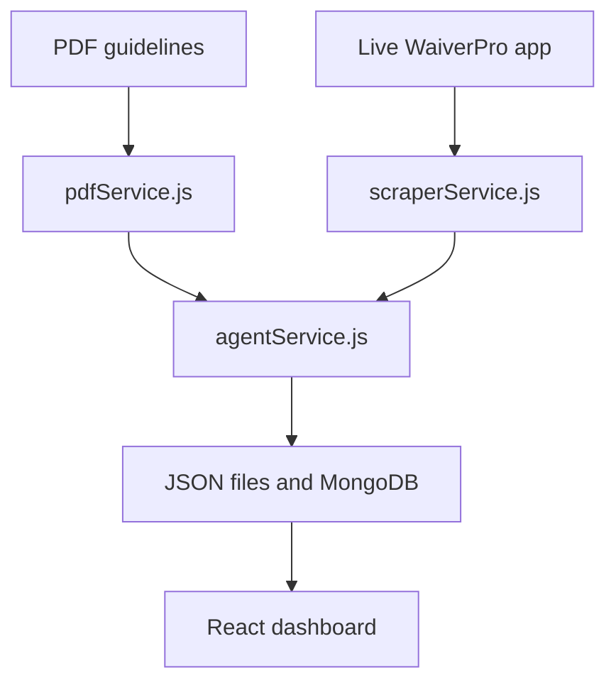

# WaiverPro Compliance Agent

A tool that checks the live WaiverPro app against the provided PDF guidelines.

Frontend: [https://waiverpro-compliance-agent.vercel.app/](https://waiverpro-compliance-agent.vercel.app/)

Backend: [https://waiverpro-compliance-agent-36so.onrender.com](https://waiverpro-compliance-agent-36so.onrender.com)

---

## 1. Setup

### Prerequisites
* Node.js >= 18.0.0
* MongoDB running locally or a MongoDB Atlas connection string
* Gemini API key or OpenAI API key

### Install dependencies
```bash
cd waiverpro-compliance-agent
npm run install:all
```

### Environment variables
Create `backend/.env`:
```env
PORT=3000
MONGO_URI=mongodb://127.0.0.1:27017/compliance-agent
TARGET_URL=https://white-cliff-0bca3ed00.1.azurestaticapps.net/
TARGET_AUTH_EMAIL=admin@gmail.com
TARGET_AUTH_PASSWORD=password
GEMINI_API_KEY=your_gemini_api_key_here
# Optional fallback:
# OPENAI_API_KEY=your_openai_key_here
```

---

## 2. How To Run

Start the backend:
```bash
cd backend
npm run dev
```

Start the frontend:
```bash
cd frontend
npm run dev
```

Run the audit from the terminal:
```bash
cd backend
npm run audit
```

Backend API: `http://localhost:3000`

Frontend: `http://localhost:5173`

---

## 3. How The Project Works

The project follows four steps:



1. `pdfService.js` reads the PDF and creates guideline rules.
2. `scraperService.js` logs in to the live app, visits the expected pages, opens required panels, collects visible UI text, and saves screenshots.
3. `agentService.js` sends the scraped UI text and relevant guideline rules to Gemini or OpenAI for comparison.
4. The backend saves extracted UI data, the final report, coverage data, and MongoDB records.

---

## 4. Main Tools Used

* `pdf-parse` for reading PDF text.
* `puppeteer` for loading the live app and scraping rendered UI.
* Gemini or OpenAI for comparing scraped UI text with guideline rules.
* `mongoose` and MongoDB for storing report records.
* React and Vite for the dashboard.

---

## 5. Output Files

The audit writes files under `backend/public/`:

* `extracted_ui_state.json`: scraped UI elements.
* `compliance_report.json`: compliance results and mismatch details.
* `coverage_report.json`: expected route coverage.
* `screenshots/`: screenshots captured during scraping.

---

## 6. Known Limitations

* The scraper uses a fixed list of expected routes from the assignment.
* The audit depends on the live site, network speed, and login availability.
* LLM mismatch counts can vary slightly between runs.
